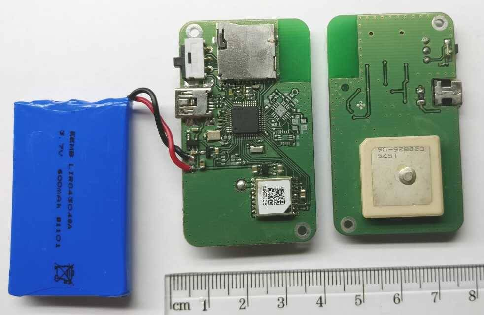
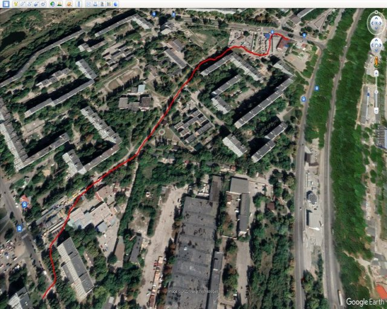

# GPS Logger with USB MSC and wireless channel (MSP430 & CC1101)

This is a prototype of GPS logging device based on MSP430F5510. The NMEA-data stream is written to a µSD-card (thanks to [FATFS](http://elm-chan.org/fsw/ff/00index_e.html)). Recorded files can be read via USB interface (USB MSC) or via wireless channel (not available in the current release). Project can be built with GCC or IAR compilers (see makefile).

To view the route, you can use any geodata visualization program ([Google Earth](https://earth.google.com), [SAS Planet](http://www.sasgis.org/sasplaneta) and others). The log file can be converted to the required format using [GPS Visualizer](https://www.gpsvisualizer.com).

**Visualization of my walk :)**

